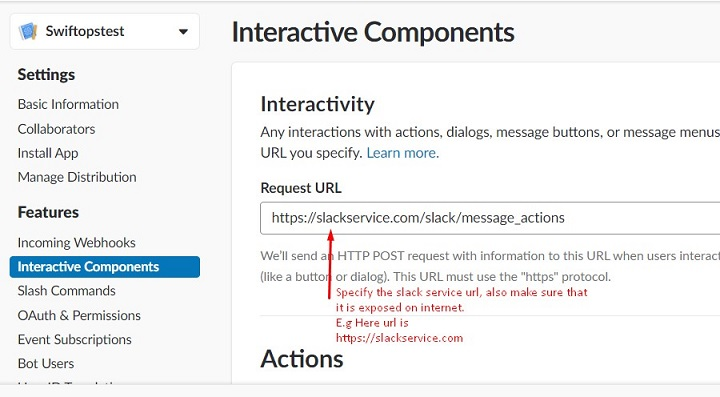
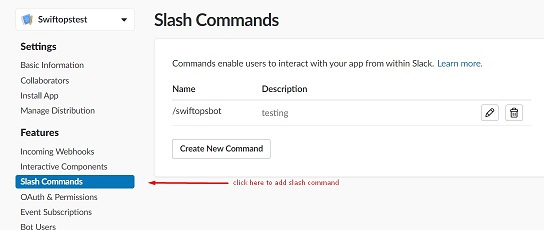
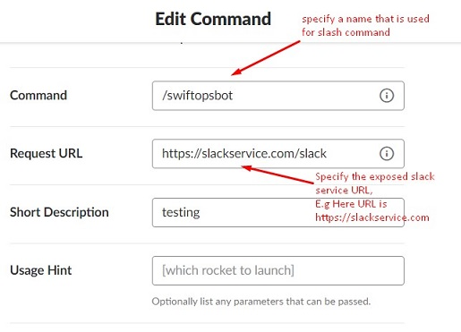
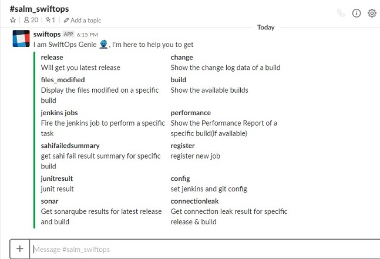

# Slack Microservice

This microservice is used as plugin with swiftops to access the following services from the slack channel:

* Fetch git change log data for given git repository. [More info](https://github.com/swiftops/git_change_log.git)

* Get JMeter performance reports. [More info](https://github.com/swiftops/jmeter-performance-report-parser.git)

* Get Junit reports. [More info](https://github.com/swiftops/junit_result_aggregation.git)

* Execute Jenkins job that is registered in Mongo database. [More info](https://github.com/swiftops/jenkins-service.git)

* Sahi failed result summary. [More info](https://github.com/swiftops/sahi-automation-result-parser.git)

* Get scanned sonar result metrics from the sonarqube server. [More info](https://github.com/swiftops/sonar-metrics.git)


## Installation

#### Checkout Repository

```

$git clone https://github.com/swiftops/slack-service.git

```

### 1. Deploy inside Docker

---

##### Pre-Requisite:

* Python 3.6.0 or above version.

* Docker should be installed on your machine. Refer [Install Docker](https://www.digitalocean.com/community/tutorials/how-to-install-and-use-docker-on-ubuntu-16-04) documentation.

* Create app on slack server. Refer [Creating apps](https://api.slack.com/slack-apps#creating_apps)

* [Root service](https://github.com/swiftops/root-service.git) is up and running.

* Generate token and user list url.[Refer documentation](https://api.slack.com/methods/users.list/test)

* Specify the Root service url, Mongo database credentials, Slack credentials, E-mail credentials and Jenkins credentials in config.ini.


##### Steps to start microservice

Once you are done with pre-requisite execute below command to start slack microservice.


1.With custom Mongo database.
Create a schema named as botengine and import the default collection i.e master.json provided in this repository.Run the below command to restore the master collection.
```
mongoimport --db botengine --collection master --file master.json --jsonArray
```
Start the service.
```
docker build -t <image-name> .
docker run -p 8080:8080 --name <container_name> -d <image-name>
```
OR


2.With default/dummy Mongo database. This will start a slack service and mongo server with default schema & collection.

```

docker-compose up --build

```

### 2. To access Microservice via slack channel

a. Install slack app in your workspace

b. Invite slack app to a channel in your workspace

c. Specify interactive components url in the slack app


d. Add slash command and specify slack service url.



e. Now your slack service is configured and ready for use. 

f. Type "/<slash_command> help" (e.g /swiftopsbot help) in the slack channel, where <slash_command> is the name specified in the step(d). This will show the list of services that can be used.



g. Type any of the above-listed service name with slash command to use it.
* E.g /swiftopsbot release


### 3. On Commit Auto-deploy on a specific server.

---

To auto-deploy, your docker container based service on the server used below steps

* You need to configure Gitlab Runner to execute Gitlab CI/CD Pipeline. See [Gitlab Config](https://docs.gitlab.com/runner/install)

<Configure .gitlab-ci.yml and deploy.sh as per your need and remove this line>

* Specify the host ip on which container is to be deployed inside deploy.sh


As soon as you configure runner auto deployment will start as you committed the code in the repository.

refer .gitlab-ci.yml file.

